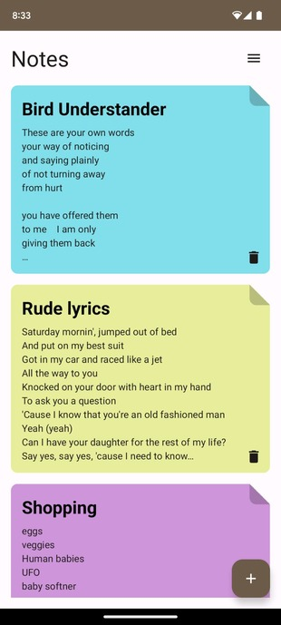
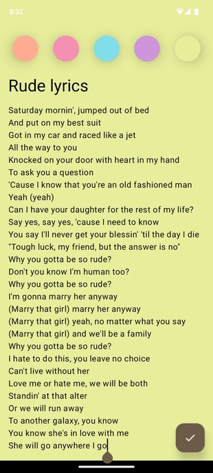

# Sticky Notes
A modern Android application to create sticky notes

## Screenshots
 

## Technical Details
- Aesthetic, smooth and creative UI
- Clean architecture (MVVM, CRUD operations)
- All UI components are made from scratch
- Utilised Dagger Hilt dependency injection
- Utilised Figma to design the UI

## Libraries and Frameworks
- [Jetpack Compose (Material 3)](https://developer.android.com/jetpack/compose/designsystems/material3)
- [Dagger Hilt Dependency Injection](https://developer.android.com/training/dependency-injection/hilt-android)
- [Room](https://developer.android.com/training/data-storage/room)
- [Compose navigation](https://developer.android.com/jetpack/compose/navigation)
- [Coroutines Flow](https://developer.android.com/kotlin/flow) 